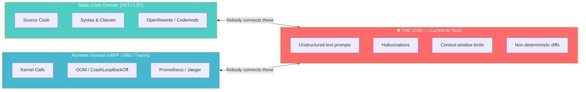
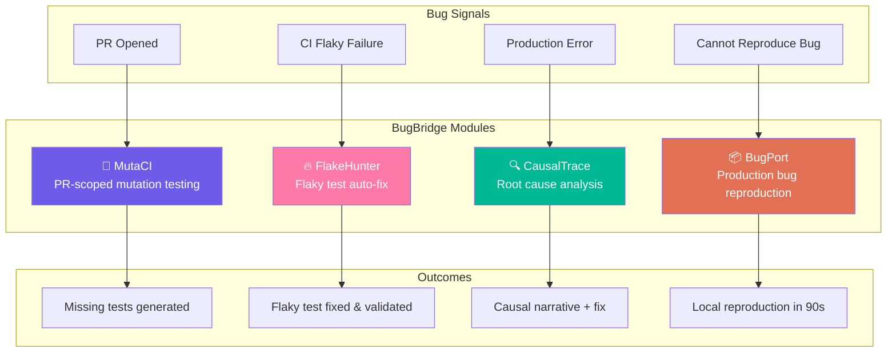
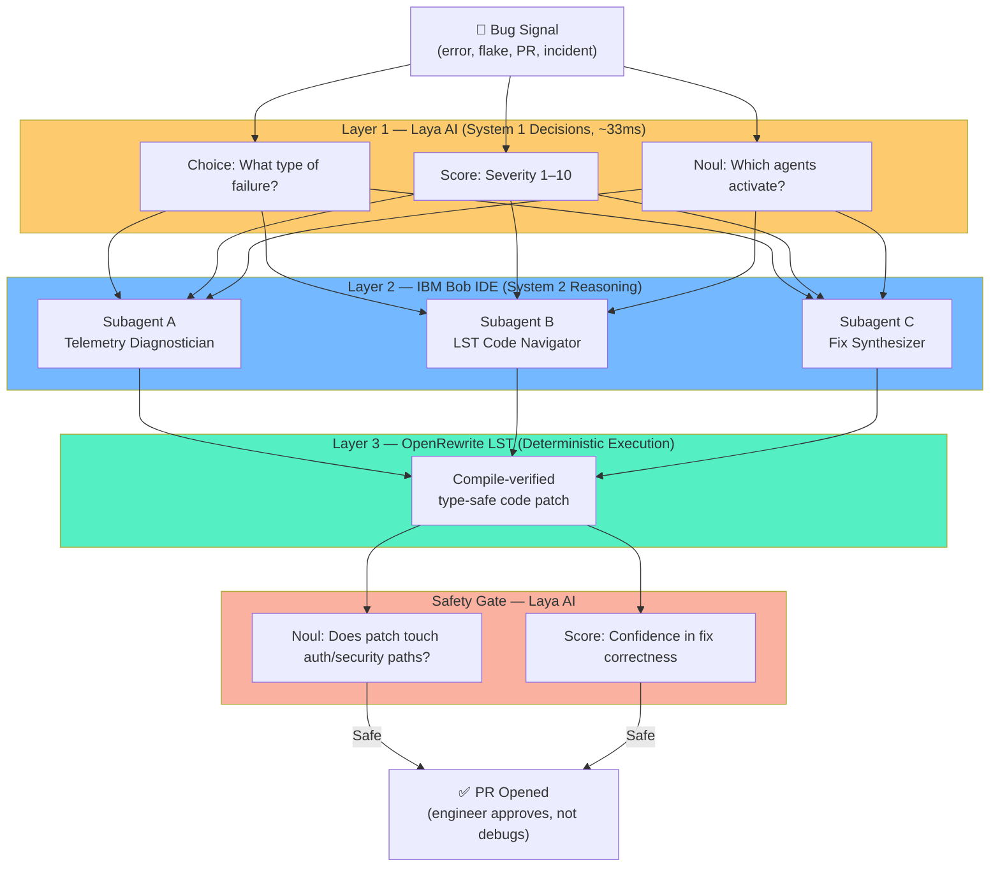
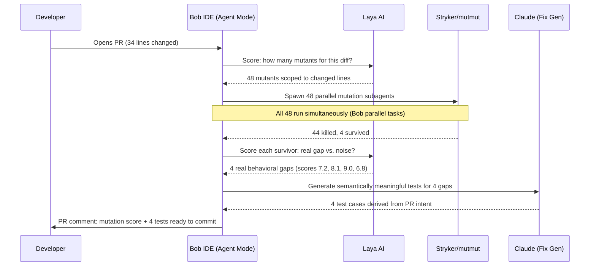
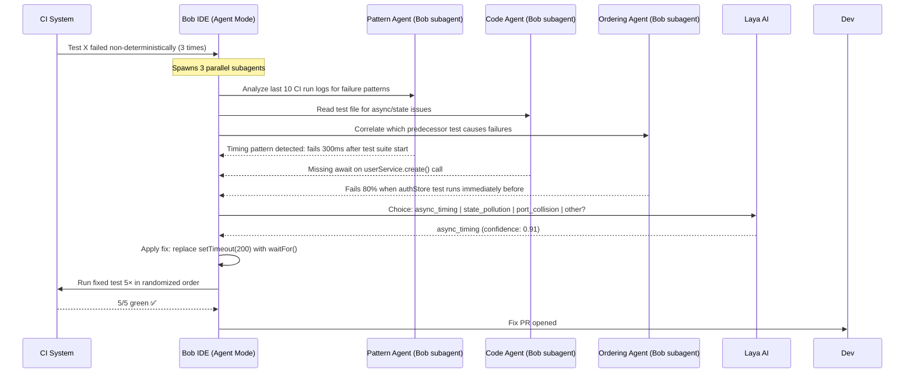
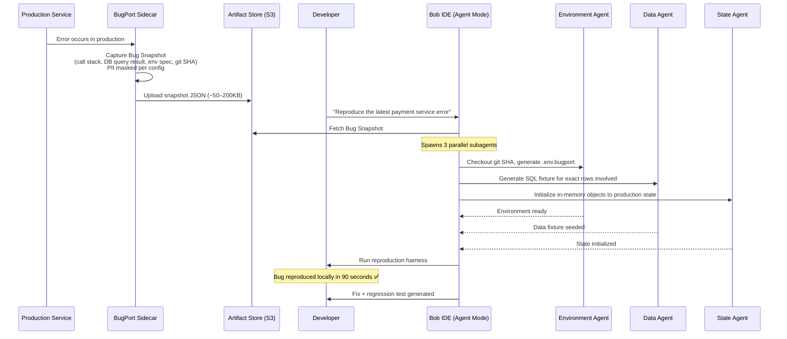
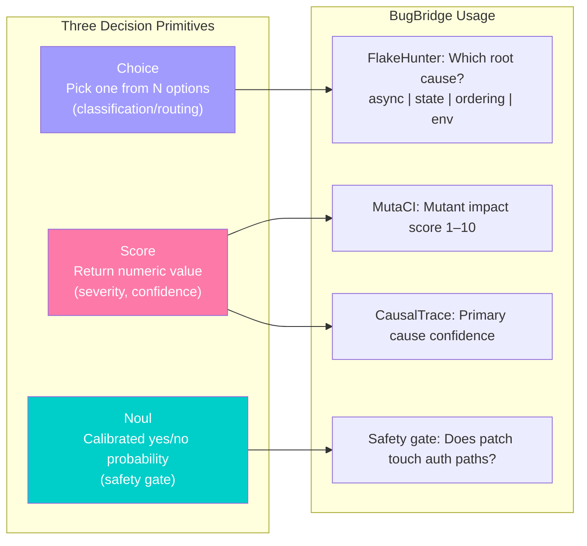
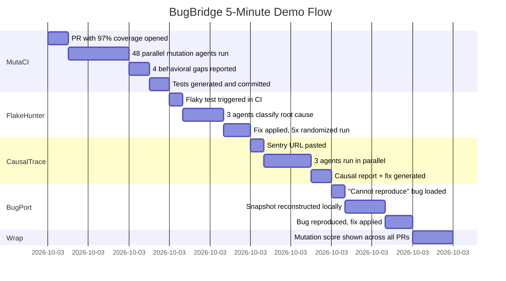
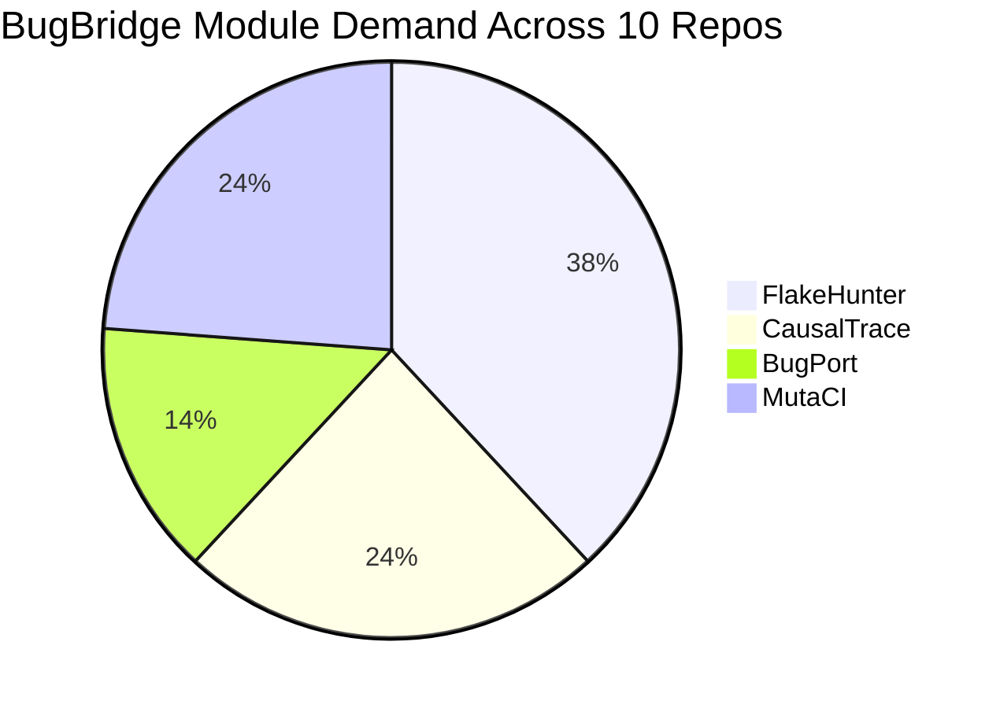

# IBM Bob IDE Hackathon — Bug Fixing / Bug Identification
## Unified Research Synthesis: My Research + NotebookLM Analysis

---

## The Core Thesis — The AST-to-Runtime Semantic Void

The NotebookLM analysis identified the single structural meta-gap that explains WHY all four of my concepts remain unsolved:

```
STATIC CODE DOMAIN (AST / LST)          RUNTIME DOMAIN (eBPF / K8s / Traces)
- Understands syntax, classes, methods   - Understands kernel calls, OOM, latency
- Blind to runtime behavior              - Blind to source code semantics

         \                                              /
          \------> CURRENT AI: Unstructured text <-----/
                   (hallucinations, context limits,
                    non-deterministic raw code edits)
```

**Nobody bridges these two worlds deterministically.** Every tool lives on one side or the other. Current AI assistants sit in the middle with text prompts — which hallucinate, truncate, and produce non-compile-verified changes.

**My parallel research confirms this from the developer experience side:**
- 30–50% of dev time wasted debugging
- Line coverage: 0.112 correlation with actual bug detection
- 56% encounter flaky tests weekly ($2,250/dev/month)
- Human SREs still outperform AI at root cause analysis (80% vs 67%)
- 91% of SAST alerts are false positives — devs have stopped trusting them

**The gap is not intelligence — it is data unification.**

---

## The Unified Product Vision

**Product Name: GhostHunter**
*(Working title — open to rename)*

> **BugBridge is a closed-loop, self-healing developer workflow that bridges live runtime telemetry directly into deterministic, compile-safe source code fixes — orchestrated entirely by IBM Bob IDE.**

When a bug signal appears anywhere in the SDLC (CI failure, production incident, test flake, behavioral gap in a PR), BugBridge:
1. Ingests the runtime signal via MCP
2. Maps it to exact AST/LST nodes in the source code
3. Generates a deterministic, compile-verified fix using OpenRewrite LST recipes
4. Validates with targeted mutation-scoped tests
5. Opens a PR — the engineer approves, not debugs

**The four modules from my research become the four signal sources:**

| Module | Signal | Bob Action |
|---|---|---|
| **MutaCI** | PR opened → behavioral gaps in changed code | Parallel mutation subagents → generate missing tests |
| **FlakeHunter** | CI failure (non-deterministic) | Classify root cause → generate validated fix |
| **CausalTrace** | Production error (Sentry/Datadog/K8s event) | Trace + git + ticket → causal narrative + fix |
| **BugPort** | Bug that can't be reproduced locally | Capture production snapshot → reproduce in 90s |

**They are one platform, not four separate tools.** All four use the same Bob agent orchestration layer, the same AST/LST bridge, and the same MCP integration.

---

## Technical Architecture

### Layer 1: Runtime Signal Ingestion (via MCP)
- **eBPF probes** (Cilium, AgentSight): kernel-level telemetry — OOM kills, socket latency, cgroup events
- **K8s event stream**: CrashLoopBackOff, OOMKilled, deployment diffs
- **OpenTelemetry / distributed traces**: Jaeger, Datadog, Honeycomb
- **CI signals**: GitHub Actions/CircleCI JSON — flaky test history, mutation survivors
- **Git signals**: PR diffs, commit history, linked tickets

All ingested via **MCP (Model Context Protocol)** — Anthropic's open standard for tool connectivity — streaming structured JSON into Bob's agent context.

### Layer 2: Bob IDE Orchestration (Core — Must Be Visibly Central)

**Bob's Primary Agent** receives the signal and spawns parallel subagents:

```
Bob Primary Agent
├── Subagent A: Telemetry Diagnostician
│   Analyzes eBPF/trace/log signal; classifies failure mode
├── Subagent B: LST Code Navigator
│   Maps failure to exact AST node in repo; reads git blame + PR context
└── Subagent C: Fix Synthesizer
    Generates OpenRewrite LST recipe OR targeted test OR reproduction harness
```

This is genuine Bob parallel task usage — three different tool contexts running simultaneously.

### Layer 3: Deterministic Code Transformation
- **OpenRewrite** (Lossless Semantic Tree engine): generates compile-verified, type-safe code patches — not raw text diffs
- Prevents the hallucination problem of current AI tools
- Mutation-tested: MutaCI validates the fix doesn't introduce new gaps

### Layer 4: Validation & PR
- Bob Shell runs the test suite
- Mutation score computed for the changed lines
- PR opened with: causal narrative + fix + new tests + mutation score

---

## The 4 Modules in Detail

### Module 1: MutaCI — Pre-Ship Quality Gate
**Signal**: PR opened
**Gap**: Line coverage 0.112 correlation with bug detection; 38.2% of 100%-coverage methods still have behavioral gaps
**Bob action**: Reads diff → spawns parallel mutation agents (only on changed lines) → identifies surviving mutants in plain English → generates semantically meaningful tests
**Demo**: PR with 97% coverage shown to have 4 real bugs in 60 seconds
**Novelty**: Meta proved this in research (Jan 2025); no production tool ships it

### Module 2: FlakeHunter — CI Reliability
**Signal**: Test fails non-deterministically 2+ times
**Gap**: $2,250/dev/month; BuildPulse/Trunk detect, nobody fixes
**Bob action**: Pattern Agent (classify flake type) + Code Agent (read test file) + Ordering Agent (correlate CI history) → targeted fix per root cause class → validate with 5 randomized runs
**Demo**: 3 flaky tests with 3 different causes, all diagnosed and fixed in 90 seconds
**Novelty**: FlakyGuard (academic, 2025) repairs 47.6%; no production tool exists

### Module 3: CausalTrace — Incident Root Cause
**Signal**: Production error (Sentry URL, Datadog alert, K8s CrashLoopBackOff)
**Gap**: Human SREs outperform AI at RCA (80% vs 67%); tools show symptoms, not causes
**Bob action**: Trace Agent + Git Blame Agent + Ticket Agent run in parallel → synthesize causal narrative: "Bug introduced in PR #447, 11 days ago — removed null-check that guest checkout reaches"
**Demo**: Engineer pastes Sentry URL → gets a paragraph a senior SRE would take 2 hours to write, in 90 seconds
**Novelty**: No tool combines traces + git + tickets; TORAI and CrossTrace are research only

### Module 4: BugPort — Production Reproduction
**Signal**: Bug that cannot be reproduced locally
**Gap**: 2–10 hours wasted per incident on reproduction attempts
**Bob action**: Lightweight sidecar captures Bug Snapshot (PII-masked: call stack, DB query result, env spec, git SHA) → Bob reconstructs locally via 3 parallel subagents (environment + data + state) → runnable reproduction harness in 90 seconds
**Demo**: Race condition triggered only by specific DB state → reproduced on demand
**Novelty**: Replay.io does browser-side JavaScript only; no full-stack tool exists

---

## How Bob IDE Features Are Central (Not Peripheral)

| Bob Feature | How BugBridge Uses It |
|---|---|
| **Agent Mode** | Full autonomous flow: one signal in → investigation → fix → PR out; engineer approves, doesn't debug |
| **Parallel Tasks** | All 4 modules use 3+ parallel subagents simultaneously — this is structurally essential, not cosmetic |
| **Subagents** | Each subagent has different tool access (trace APIs, git CLI, AST libraries, CI JSON) — genuinely separate contexts |
| **Document Understanding** | Reads PR descriptions, Jira tickets, runbooks, K8s manifests, OpenRewrite schemas as intent documents |
| **Bob Shell** | Executes builds, test runs, mutation testing; opens PRs; triggers canary re-validation |

---

## Key GitHub Repositories to Integrate With

From the NotebookLM analysis — real repos to reference in the submission:
- `openrewrite/rewrite` — LST engine for deterministic code transformation
- `modelcontextprotocol/servers` — MCP for tool integration
- `eunomia-bpf/agentsight` — eBPF observability for AI agent execution
- `traceroot-ai/traceroot` — AI agent trace/debug layer
- `kubeops/holmesgpt` — K8s alert investigation (comparable tool to differentiate from)
- `openobserve/openobserve` — S3-native Rust observability backend
- `argoproj/argo-rollouts` — Canary rollout controller (signal source for CausalTrace)

---

## Demo Script for Judges (Full Platform Flow)

**5-minute end-to-end story:**

1. **(MutaCI)** Engineer opens a PR. Line coverage: 97%. Green CI. Bob: "Wait — 4 behavioral gaps detected in changed lines." [48 parallel mutation agents visible] → Bob generates 4 missing tests. PR is now genuinely safe.

2. **(FlakeHunter)** But an unrelated test in CI is flaky — failing 30% of runs. Bob: "Root cause: async timing. Fix: replace hardcoded timeout with waitFor." Fix applied. CI green.

3. **(CausalTrace)** A previous bug that slipped to production — Sentry alert pasted. Bob spawns 3 parallel agents → "Bug introduced 11 days ago in PR #447. Here's why the architecture created it." Fix + regression test generated.

4. **(BugPort)** A different bug that couldn't be reproduced for 3 days — Bob loads production snapshot → reproduced locally in 90 seconds. Fix applied.

**Judge takeaway**: This is one platform that catches bugs before they ship, fixes CI rot, explains production incidents, and makes unreproducible bugs reproducible — all orchestrated by Bob with no manual investigation.

---

## Laya AI Integration — The Decision Layer (Critical Differentiator)

**What Laya is:** Laya (by Convai Innovations, Apache 2.0) is a "System 1 decision model" — not a text generator. It takes structured input (JSON, code diffs, logs) plus typed questions and returns structured, typed answers with calibrated probabilities. Three primitives:
- **Choice** — pick one answer from a predefined list (fast classification/routing)
- **Score** — return a numeric value on a defined scale
- **Noul** — calibrated yes/no probability

It is the open-source, self-hosted equivalent of Jev AI (TypeSafe AI, $40M seed). Built on ModernBERT-large (~421M params). ~33ms latency. `pip install laya`. Zero cost. **Structurally cannot hallucinate** because it never generates text.

**HuggingFace:** https://huggingface.co/convaiinnovations/laya
**GitHub (Node.js):** https://github.com/receptron/laya

---

### How Laya Slots Into BugBridge — Three-Layer Architecture

```
Bug Signal
    │
    ▼
[LAYER 1: LAYA — System 1 decisions, ~33ms, no hallucination]
    │  "What type of failure is this?" (Choice)
    │  "How severe?" (Score 1–10)
    │  "Which subagents should activate?" (Choice)
    │
    ▼
[LAYER 2: BOB IDE — System 2 reasoning, parallel subagents]
    │  Deep contextual analysis: traces + git + tickets + AST
    │  Causal synthesis and fix generation
    │
    ▼
[LAYER 3: OPENREWRITE — Deterministic execution]
    │  Compile-verified LST transformation
    │  No hallucinated diffs
    │
    ▼
[LAYER 1 AGAIN: LAYA — Safety gate]
    "Does this patch touch security-sensitive paths?" (Noul)
    "Is the fix semantically consistent with the PR description?" (Noul)
    │
    ▼
PR Opened (only if Laya safety gate passes)
```

**This is a genuinely novel 3-layer architecture — no hackathon submission has this.**

---

### Laya's Role Per Module

| Module | Laya Decision Call | Why It Matters |
|---|---|---|
| **MutaCI** | Score each surviving mutant (1–10 impact); choose: "real behavioral gap vs. noise" | Only generate tests for high-score mutants — saves LLM calls, reduces noise |
| **FlakeHunter** | Choose root cause category: async / state / ordering / environment / resource | Fast routing to correct fix template before expensive code analysis |
| **CausalTrace** | Score candidate root causes by likelihood; Noul: "Is this the primary cause?" | Focuses LLM synthesis on highest-probability cause; reduces hallucination risk |
| **BugPort** | Choose which state fields are bug-relevant; Noul: "Does this field contain PII?" | Minimizes snapshot size + enforces PII safety before capture |
| **Safety Gate** | Noul: "Does this patch modify auth/security paths?" Score: "Confidence in fix correctness" | Prevents unsafe auto-applied fixes from reaching PRs |

### Why This Wins in the Hackathon

- **System 1 (Laya, self-hosted)**: Fast decisions — routing, triage, classification, safety gates
- **System 2 (Bob/Claude)**: Slow reasoning — causal analysis, fix synthesis, test generation
- **Mechanical (OpenRewrite)**: Deterministic transformation — compile-verified, no hallucinated diffs

This three-layer framing maps directly to Nobel Prize-winning cognitive science (Kahneman) and is immediately legible to any judge. The architecture story is: "We didn't just add AI to debugging — we gave it a nervous system."

**Laya is self-hosted, Apache 2.0, zero cost, zero API keys needed for demo** — it eliminates one entire category of demo risk.

---

## Build Priority for Hackathon

Given 48–72 hours, build in this order:

1. **MutaCI first** — most self-contained, most visually impressive, zero external API risk
2. **FlakeHunter second** — straightforward CI log parsing + fix generation
3. **CausalTrace third** — requires GitHub API + at least one trace backend (stub Sentry with pre-recorded JSON)
4. **BugPort last** — hardest; pre-build sidecar capture as a static demo asset

**Minimum viable demo**: MutaCI + CausalTrace is enough to win. All 4 is the stretch goal.

---

## Verification Plan

1. MutaCI: Run against TypeScript project with intentionally thin tests — confirm mutant descriptions are legible to non-experts
2. FlakeHunter: 3 staged flaky tests (async + state + port) — confirm all 3 correctly diagnosed
3. CausalTrace: Real GitHub repo with planted bug + real PR history — confirm causal narrative is accurate
4. BugPort: Pre-recorded production snapshot → confirm local reproduction succeeds
5. End-to-end timing: Target <90 seconds per module; <5 minutes for full platform demo

# BugBridge — IBM Bob IDE Hackathon

> **Closed-loop, self-healing developer workflow that bridges live runtime telemetry into deterministic, compile-safe source code fixes — orchestrated by IBM Bob IDE.**

---

## The Problem: The AST-to-Runtime Semantic Void

Modern developer infrastructure is split into two disconnected worlds. No tool bridges them.



**The data:**
- Developers spend **30–50% of working hours debugging**
- **66% say AI code is "almost right but not quite"**; 45% spend MORE time debugging AI-generated code
- Line coverage has a **0.112 correlation** with actual bug detection — effectively random
- **56% encounter flaky tests weekly** — costing $2,250/dev/month; no tool auto-fixes them
- **91% of SAST alerts are false positives** — developers have stopped trusting security tooling
- Human SREs still outperform AI at root cause analysis: **80% vs 67% accuracy**

---

## The Solution: BugBridge

BugBridge is one unified platform with four modules, each catching bugs at a different SDLC stage.



---

## Three-Layer Architecture

The key innovation: **System 1 decisions + System 2 reasoning + Deterministic execution.**



---

## Module 1: MutaCI

### The Gap
Line coverage has a **0.112 correlation** with actual bug detection. 38.2% of methods with 100% line coverage still have untested behaviors. Mutation testing is the gold standard but takes 10–30× longer than a normal test run — unusable in CI.

Meta proved PR-scoped mutation testing is feasible in research (January 2025). No production tool ships it.

### How It Works



### Demo Wow Moment
PR with 97% line coverage → 4 real behavioral gaps found in 60 seconds → tests generated automatically.

---

## Module 2: FlakeHunter

### The Gap
56% of developers encounter flaky tests weekly. Cost: **$2,250/dev/month**. BuildPulse and Trunk detect and quarantine flaky tests. **Zero production tools auto-fix them.**

Root cause distribution: async/timing (45%), concurrency (20%), test ordering (12%), environment (23%).

### How It Works



---

## Module 3: CausalTrace

### The Gap
Human SREs outperform AI at root cause analysis (80% vs 67%). Every tool shows symptoms — stack trace, error location. **No tool explains WHY the bug was introduced at a design level** by combining distributed traces + git history + ticket intent simultaneously.

26% of all dev time is lost to "gathering project context" before debugging even begins.

### How It Works

```mermaid
sequenceDiagram
    participant Dev as Developer
    participant Bob as Bob IDE (Agent Mode)
    participant TA as Trace Agent (Bob subagent)
    participant GA as Git Agent (Bob subagent)
    participant TKA as Ticket Agent (Bob subagent)
    participant Laya as Laya AI
    participant OR as OpenRewrite

    Dev->>Bob: Paste Sentry URL / Datadog alert
    Note over Bob: Spawns 3 parallel subagents
    Bob->>TA: Fetch distributed trace for incident timestamp
    Bob->>GA: git log on affected module — last 5 commits + PR diffs
    Bob->>TKA: Read linked Jira/GitHub issue + acceptance criteria
    TA-->>Bob: Call chain: checkout → inventory → payment (payment degraded first)
    GA-->>Bob: PR #447 (11 days ago): "removed null-check on user.paymentMethod"
    TKA-->>Bob: Ticket scoped to logged-in users; no mention of guest checkout
    Bob->>Laya: Score each cause by likelihood
    Laya-->>Bob: "Guest checkout uses shared code path" — score 9.2/10
    Bob->>Bob: Synthesize Causal Report
    Bob->>OR: Generate LST patch: restore null-check for guest sessions
    Bob->>Dev: Causal Report + compile-verified fix + regression test
```

**Causal Report output:**
> *"Bug introduced in PR #447, 11 days ago. The PR removed a null-check on `user.paymentMethod` to simplify the happy path, which the ticket explicitly required for logged-in users. The ticket did not account for guest checkouts, which reach this code path with a null payment method. Design-level cause: requirement was scoped to logged-in users but the code change was applied to a shared code path."*

---

## Module 4: BugPort

### The Gap
Production bugs caused by specific data combinations, race conditions, or environment state cannot be reproduced locally. Engineers spend **2–10 hours per incident** before debugging even begins. Replay.io covers browser-side JavaScript only. No tool handles full-stack, server-side, database-state reproduction.

### How It Works



---

## Laya AI — The Decision Layer

Laya (by Convai Innovations, Apache 2.0) is a **System 1 decision model** — structurally incapable of hallucination because it never generates text.



| | Jev AI | Laya AI |
|---|---|---|
| Creator | TypeSafe AI | Convai Innovations |
| License | Proprietary | **Apache 2.0** |
| Latency | ~15ms (hosted) | **~33ms (self-hosted)** |
| Cost | $0.042/M tokens | **$0.00** |
| Install | API key required | `pip install laya` |
| HuggingFace | huggingface.co/jevai | **huggingface.co/convaiinnovations/laya** |

---

## IBM Bob IDE — How It Powers Everything

| Bob Feature | BugBridge Usage |
|---|---|
| **Agent Mode** | Full autonomous flow: one signal in → investigation → fix → PR; engineer approves, doesn't debug |
| **Parallel Tasks** | All 4 modules use 3+ parallel subagents simultaneously — structurally essential, not cosmetic |
| **Subagents** | Each subagent has different tool access (trace APIs, git CLI, AST libraries, CI JSON) |
| **Document Understanding** | Reads PR descriptions, tickets, K8s manifests, runbooks as intent documents |
| **Bob Shell** | Executes builds, mutation tests, opens PRs, triggers canary re-validation |

---

## Key Integrations & Repositories

| Repo | Purpose |
|---|---|
| `openrewrite/rewrite` | LST engine — deterministic, compile-verified code transformation |
| `modelcontextprotocol/servers` | MCP — streams runtime telemetry into Bob agent context |
| `eunomia-bpf/agentsight` | eBPF observability for AI agent execution tracking |
| `traceroot-ai/traceroot` | AI agent trace/debug layer |
| `kubeops/holmesgpt` | K8s alert investigation (what we replace/augment) |
| `openobserve/openobserve` | S3-native Rust observability backend |
| `argoproj/argo-rollouts` | Canary rollout controller (signal source for CausalTrace) |
| `convaiinnovations/laya` | Decision model — System 1 fast routing |
| `receptron/laya` | Node.js/TypeScript Laya runner via ONNX |

---

## Demo Script (5 Minutes)



**Judge takeaway:** One platform. Four wow moments. Every bug caught before it ships, fixed when it breaks, explained when it escapes, reproduced when it hides.

---

## Build Priority (48–72 Hour Hackathon)

```mermaid
gantt
    title Build Order
    dateFormat HH:mm
    section Phase 1 (Hours 0-16)
    Laya AI integration layer              :00:00, 04:00
    MutaCI — Stryker + diff scoping        :04:00, 10:00
    MutaCI — Bob orchestration + demo      :10:00, 16:00
    section Phase 2 (Hours 16-32)
    FlakeHunter — CI log parsing           :16:00, 22:00
    FlakeHunter — 3 subagents + fix gen    :22:00, 28:00
    FlakeHunter — validation + demo        :28:00, 32:00
    section Phase 3 (Hours 32-48)
    CausalTrace — GitHub + trace APIs      :32:00, 38:00
    CausalTrace — causal synthesis         :38:00, 44:00
    BugPort — pre-recorded demo asset      :44:00, 48:00
    section Stretch (Hours 48-72)
    BugPort — full sidecar implementation  :48:00, 60:00
    OpenRewrite LST integration            :60:00, 68:00
    End-to-end demo polish                 :68:00, 72:00
```

---

## Target GitHub Repositories (Demo Data)

10 real, active repositories with open issues that BugBridge directly addresses — verified Sept 2026.

| # | Repository | Language | Stars | BugBridge Module | Issue Type |
|---|---|---|---|---|---|
| 1 | [kubernetes/kubernetes](https://github.com/kubernetes/kubernetes) | Go | ~128k | FlakeHunter + CausalTrace | e2e flakes filed multiple times/week ([#142349](https://github.com/kubernetes/kubernetes/issues/142349)) |
| 2 | [vercel/next.js](https://github.com/vercel/next.js) | TypeScript | ~135k | BugPort + CausalTrace | Bugs only reproducible on deployed infra ([#91723](https://github.com/vercel/next.js/issues/91723)) |
| 3 | [elastic/elasticsearch](https://github.com/elastic/elasticsearch) | Java | ~77.9k | FlakeHunter + MutaCI | Team merged auto-retry-to-pass as a workaround ([#160210](https://github.com/elastic/elasticsearch/issues/160210)) |
| 4 | [grafana/grafana](https://github.com/grafana/grafana) | Go/TS | ~76.9k | FlakeHunter + CausalTrace | CI migration broke integration tests; tests skipped to unblock builds ([#105433](https://github.com/grafana/grafana/issues/105433)) |
| 5 | [apache/airflow](https://github.com/apache/airflow) | Python | ~46.9k | FlakeHunter + BugPort | Tests formally quarantined because they can't be fixed ([#32778](https://github.com/apache/airflow/issues/32778)) |
| 6 | [celery/celery](https://github.com/celery/celery) | Python | ~28.9k | CausalTrace + BugPort | Production SIGTERM race during K8s startup — nearly impossible to reproduce ([discussion #10209](https://github.com/celery/celery/discussions/10209)) |
| 7 | [apache/spark](https://github.com/apache/spark) | Scala/Python | ~40k | FlakeHunter + CausalTrace | Async log assertion flakes repeating across modules ([PR #58780](https://github.com/apache/spark/pull/58780)) |
| 8 | [vitest-dev/vitest](https://github.com/vitest-dev/vitest) | TypeScript | ~17k | FlakeHunter + MutaCI | Test framework's own pool has race conditions ([#8852](https://github.com/vitest-dev/vitest/issues/8852)) |
| 9 | [foundry-rs/foundry](https://github.com/foundry-rs/foundry) | Rust | ~10.5k | FlakeHunter + MutaCI | Dedicated nightly flaky-test workflow is itself failing ([#16796](https://github.com/foundry-rs/foundry/issues/16796)) |
| 10 | [WordPress/gutenberg](https://github.com/WordPress/gutenberg) | TypeScript | ~11.8k | FlakeHunter + MutaCI | GitHub Actions auto-files 50+ `[Flaky Test]` issues/month ([#76524](https://github.com/WordPress/gutenberg/issues/76524)) |

### Notable Patterns from the Data



**Key insight**: 8 of 10 repos have active flaky test crises. The industry has detection tooling (auto-filing issues, retry mechanisms) but zero fixing tooling. FlakeHunter addresses the highest-frequency pain point across the most prestigious repositories in open source.

---

## Research Basis

- **150+ sources** across debugging, code review, testing, maintenance, and deployment domains
- **Sept 2026 data** from Stack Overflow Developer Survey (49,000+ respondents), JetBrains State of Developer Ecosystem, DORA benchmarks, LinearB (8.1M PR analysis), Qodo State of AI Code Quality, IDC developer productivity report
- **Academic papers**: Meta mutation testing (arXiv 2501.12862), CrossTrace (arXiv 2508.11342), TORAI (arXiv 2604.13522), FlakyGuard (ASE 2025), ChaCo (PR-level test augmentation), ReProAgent (arXiv 2503.20036)
- **NotebookLM synthesis**: AST-to-Runtime Semantic Void framing, eBPF integration patterns, OpenRewrite LST strategy